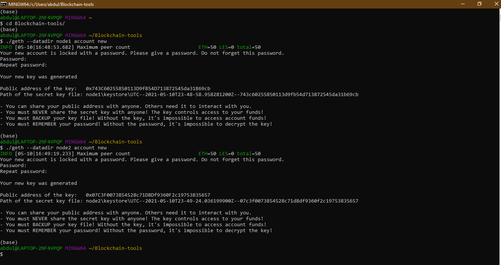
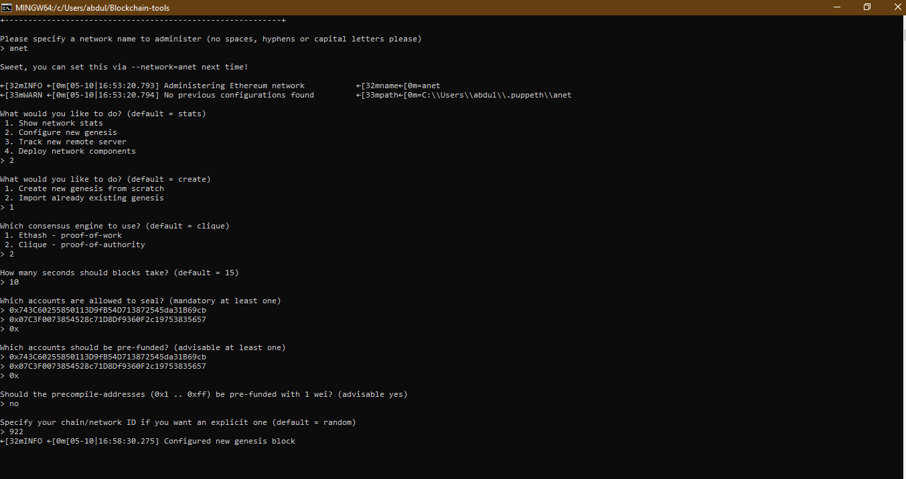
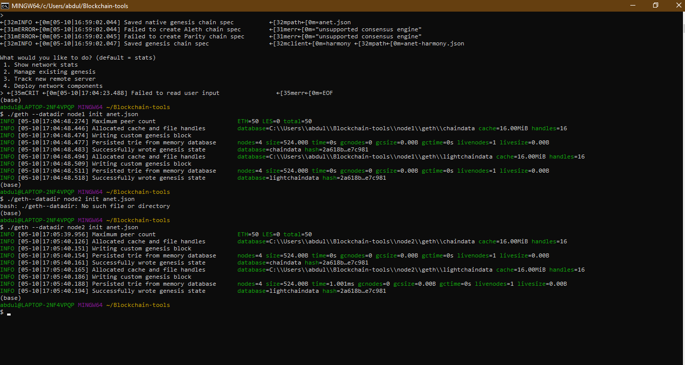
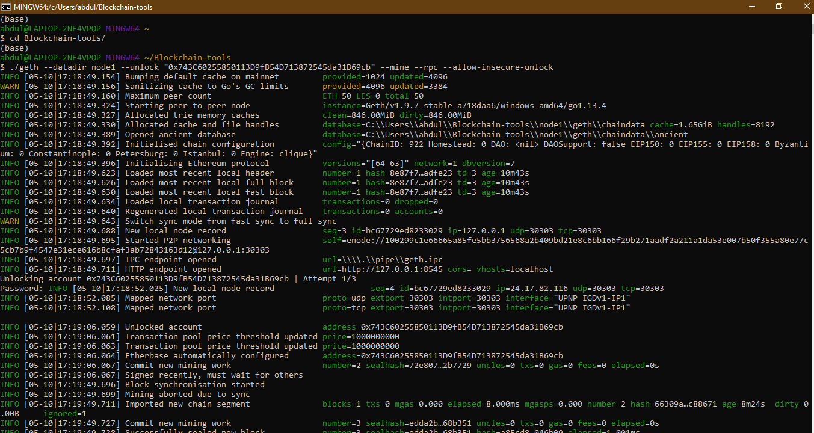
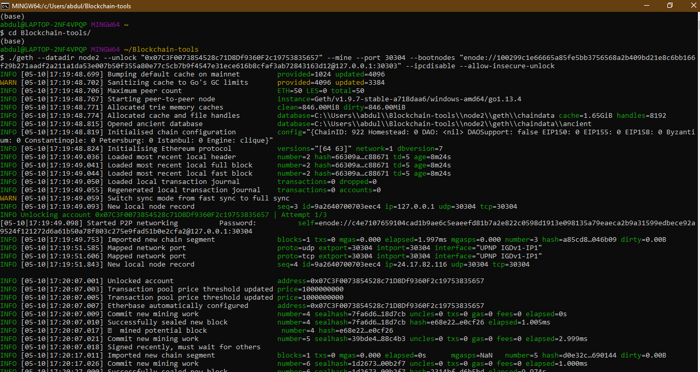
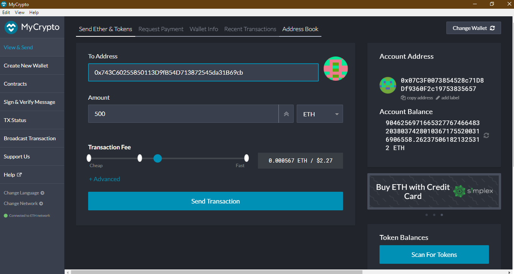
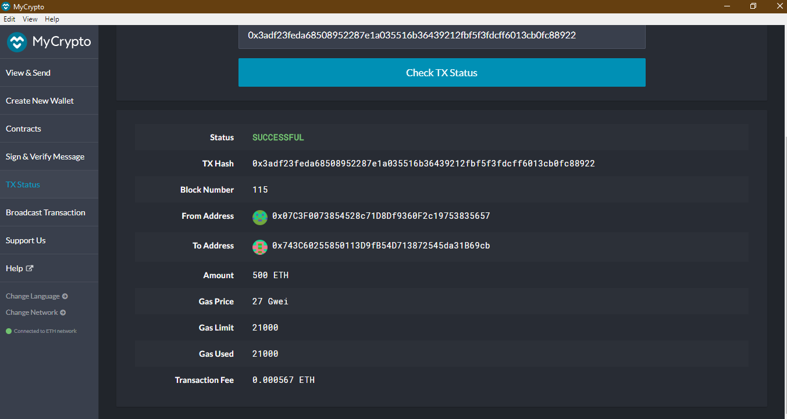

# POA_Blockchain

### Steps to creating a Proof of Authority Blockchain
---
1. Open gitbash and naviagate to the directory containing geth

2. Create two node accounts and save the adresses generated

      `./geth --datadir node1 account new`

3. Run puppeth, name your network, and select the option to configure a new genesis block.

* Choose the Clique (Proof of Authority) consensus algorithm.
* Paste both account addresses from the first step one at a time into the list of accounts to seal.
* Paste them again in the list of accounts to pre-fund. There are no block rewards in PoA, so you'll need to pre-fund.
* Choose the "proof-of-authority" consensus engine and decide on a chain ID. After you answer all the promts go back the main menu choose "Manage existing genesis" option, and then export the genesis configurations.

4. With genesis block created, initalize nodes with genesis json file

* `./geth --datadir node1 init anet.json
./geth --datadir node2 init anet.json`

5. Run the nodes to begin mining blocks. Execute this code in two different terminals (gitbash).
* SEALER_ONE_ADDRESS and SEALER_TWO_ADDRESS are the 2 addresses that were generated in step 2. The SEALER_ONE_ENCODE_ADDRESS is generated when you start and run the first node. Copy that into where it says "SEALER_ONE_ENCODE_ADDRESS".

* `./geth --datadir node1 --unlock "SEALER_ONE_ADDRESS" --mine --rpc --allow-insecure-unlock`

* `./geth --datadir node2 --unlock "SEALER_TWO_ADDRESS" --mine --port 30304 --bootnodes "enode://SEALER_ONE_ENODE_ADDRESS@127.0.0.1:30303" --ipcdisable --allow-insecure-unlock`

 
 
6. Open the MyCrypto app while both nodes are up and running. Click Change Network at the bottom left to add your POA blockchain to Mycrypto
* Click "Add custom node" and select custom in the network column
* Type ETH in the Currency box.
* In the Chain ID box, type the chain id from genesis creation (922 in my case).
* In the URL box type: http://127.0.0.1:8545.
* Click Save & Use custom node 

7. Open your wallet using the keystore file for either node1 or node2.
* If you followed these setps correctly there should be a lot of ether in your account balance
* paste the wallet adress of the other node into the top and send a transaction 

8. Check Transaction Status after you confirm the transaction

